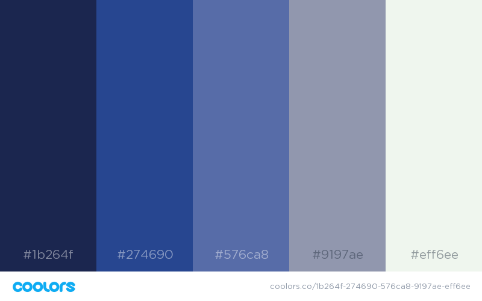

# wdi-project-4
===

##BodhiNomad: A investment management application

### Assignment
**Description:** A solo project. Come up with a website idea, design it, and develop it. It should have a back-end API, front-end logic, and it should be developed within a week, whereupon it should be at MVP stage. The scope of the project is entirely up to me.

###Technologies used:
I used the following technologies to make this website:
- HTML/SASS
- Bootstrap
- AngularJS
- Ruby on Rails (API)
- PostgreSQL
Three external data sources were used:
1. Quandl API for the chart data
2. MarkitOnDemand(v2) API for company Name, EPIC, and Exchange
3. Google Finance (not an API)

###Chosen topic
**Description:** A website which has user authentication. Once logged in, the user should be able to search for stocks on the US Stock exchange, retrieve a live market price and chart data. Then the user should be able to virtually purchase shares at the live market price.
Once the user has purchased one or more stocks, they should be able to view their trading history with comments on each purchase, and a portfolio summary where they can sell the share bought. The porfolio summary & trading history should show whether the trade is in profit or loss.
The biggest challenge for this project is to retrieve live market prices for stocks for free, without paying the expensive fees of corporate API's where fees start from c. $50/m.

---

###User experience
1. Given this is an investment management application, going by online examples such as Hargreaves Lansdown or Halifax Share Dealing, slick design is not an issue. Getting accurate market data and a smooth user experience to trade is a priority. As such keep the site design simple.
2. The user registers with:
	- Username
	- Firstname
	- Lastname
	- Email
	- Password
	- Password Confirmation
3. The user logs in with email and password.
4. The landing page after logging in is the search page for the stocks.
5. The user can enter a name into the search box, and the search box will live return recommendations of stocks they might be looking for, along with the index.
6. Once clicking on the security, the site retrieves a live market price, and displays historic price data on a graph.
7. If the user clicks the 'buy' button, a modal pops up to purchase the shares by nominal. Here the site should calculate live the total value of the purchase. If the user here can also enter in a comment on the trade rational.
8. Once clicking buy, the site should redirect to the portfolio summary so the user can see their new purchase.
9. On the portfolio summary page, live prices are retrieved so the user knows what the total profit they have per trade, and for the whole portfolio.
10. Here the user should also be able to sell shares held.
	- They should not be able to sell more shares than they currently hold.
10. If the user wants to see their individual trades, they can click on the Trades tab to see their history. Here they should be able to see all past trades, comments for each trade, and the profit/loss made on each trade.

**Additional points:** It would be nice for the site to be mobile responsive if I have time.

---

###Application programming interfaces to use:
1. **Quandl:** [Link] (https://www.quandl.com/)
2. **MarketOnDemand:** [Link] (http://dev.markitondemand.com/MODApis/)
3. **GoogleFinance:** [Link] (https://www.google.co.uk/finance) (not an API)

###Colour Theme
The website styling is not a priority. The focus should be on the functionality, as such the colour scheme should not distract from the main page. Choose from a range of these blues:

###Font
The website should have a clean font that is easy to read, and rounded edges to have a little style. Shortlisted are:
	- font-family: 'Trirong', serif;
	- font-family: 'Raleway', sans-serif;
	- font-family: 'Cormorant Garamond', serif;
	- font-family: 'Cinzel', serif;
	- font-family: 'Satisfy', cursive;
	- font-family: 'Nixie One', cursive;
My favoured font to use is: Raleway.

###Thinking through the problem

**Authentication:**
Angular authenticaiton has been done before on the previous project Novelists. Therefore copy this in. Back-end rails API has not been done before, use classwork example with Devise & JWT tokens.

**Live market prices:**
Having explored a lot of potential API's online and nearly paying for data on one, I decided a suitable solution would be to retrieve a live price from the Google Finance website (unfortunately it closed its API c. 5 years ago). Getting a free live market price is the priority of the whole project. Given this is not an API & Google Finance does not support CORS, this data will need to be requested in the back-end.
**Chart data:**
Quandl chart data has basic instructions. Only the US equity market price data is free, UK prices require a subscription to the LSE.
**List of recommended stocks:**
Not much time was spent on this, I found the MarkitOnDemand API which is aimed at their employees testing with market data, but seems openly accessible to external users without a Auth Key. Without spending time looking further, this returns 20 recommendations for each request, and the data for each item includes Name, Exchange & EPIC.
**Placing trades:**
When placing a trade the site should retrieve a live market price. Simple front-end logic in Angular should be able to calculate the value of the trade. Once placing the trade, on return of the HTTP response have a redirect to the Portfolio summary page.
**Portfolio summary:**
The main issues here are retrieving a live market price for each security, summing up each trade, and not allowing the user to sell more shares than they currently hold.
The live market price data should be requested in Angular through lining up asynchronous requests with a forEach loop through each individual security.
The sum of each securities trades (assuming positive) should be done within Rails creating a new model for the User to sum the number of shares.

---

###Problems faced during development

-I have only been learning Ruby and Rails for < 3 weeks. As such it proved a hindrance in working out where to put the various bits of logic required.
-Working with PostgreSQL for the first time was good. From making a basic initial table, I had to make various changes with the Migrations which helped me understand better what was going on. I had to do one or two 'git reset --hard' when I made mistakes.
-With my familiarity of AngularJS & JavaScript, and my lack of confidence with Rails I found myself trying to put too much of the logic in the front-end, where it should have been in the back-end. Things such as summarising the portfolio trades into the portfolio summary page.
-Google Finance blocked my access late at night once due to the number of requests I was making. This caused a serious panic when I thought I had broken my whole App.
The MarkitOnDemand API seems to have an issue with accessing too many requests at once, and blocking my access. It comes up with the error:
	`Cannot read property 'token' of null`
I didn't have time to figure this out. The short-term fix is to enter the letters into the search bar slowly.
-Getting the live market price from Google Finance was a considerable challenge and took a couple of days to figure out. This massively improved my understanding of CORS requests, and it was fun to use Ruby's easy string splicing since Google Finance returns the data with an // infront of the JSON.
-The Quandl API data was piped onto a chart using HighCharts. The date was not showing up properly on highcharts, it simply shows the index number of the data. I spent a lot of time searching StackOverflow for answers to this, tried many varieties of supposed solutions, none worked. I tried converting the data by looping over it to different date formats, all to no success.

The main take-away from this is that while I enjoyed using Ruby on Rails and its easy to build Scaffold's, I have a great deal to learn when interacting with the DB to return to the front-end what I want. More learning required here.

Of the three GA week-long projects, this is the most unfinished one which is very unsatisfying. I simply did not have enough time to add all the functionality that I wanted, and only a few hours were spent styling it to give it the basic look that it has. It did not help matters that I was using Rails which I was relatively inexperienced with, when trying to do complex things such as filtering and summing data from the database, and returning to the front-end. In addition having never connected an Angular front-end App with back-end Rails took a bit of time to figure out. This app needs a lot more time to iron out faults, and add functionality.

**Additional desired functionality:**
1. When the user signs up, then can enter in a monetary value of their starting portfolio.
2. When placing purchase trades, money is deducted from the portfolio cash balance.
3. Users should not be able to sell more shares than they already own.
4. Users should be able to edit their profile details.
5. The searchbar sometimes failing to return stock recommendations needs fixed.
6. The HighCharts date bar needs to show a date, not the index.

---

##Conclusions
I am extremely proud that I managed to get as far as I did with this project with c. 4 days worth of coding. In addition figuring out how to get a free live market price was a triumph for me. 
Clearly working with FinTech presents a lot of challenges not normally faced with previous development I have done, namely ensuring the data retrieved is accurate. For example I realised after two days of getting 'live market prices' for stocks, that for some stocks it was returning a market price different from that on the Google Finance website. I realised this is because my API was retrieving the London listing, rather than the NYSE because I had not specified the exchange - 'Doh'. I therefore had to go back and edit the code to use the exchange as well as the EPIC, thereby slowing down development.
I will need to spend some time figuring out what is up with the search bar failing when typing too fast. I don't know if this is the external API failing with too many requests at once, or something wrong at my end. Perhaps a time delay on each request?

##Additional Points
I have fixed the issue with the searchbar failing to load when typing too fast. The MarkitDev API was returning the following error:
`Request blockedExceeded requests/sec limit`
A workaround was to use the `Timeout` Angular module. This works like a promise, and only runs the next request once the previous one has completed, with a 300ms delay between each one.

I discovered this site doesn't work on Internet Explorer. It comes up with two errors:
	`XMLHttpRequest for http://..... required Cross Origin Resource Sharing (CORS)`
	`XMLHttpRequest for http://..... required CORS preflight`
I looked this up and it seems I need to write a p3p program, which returns a header that IE reads which essentially states that you will not collect user data. It looks like paid software is required to generate this file, and so I've decided for now not to develop this due to the cost. Perhaps I should put something in the homepage that said "DO NOT USE IE EVER".